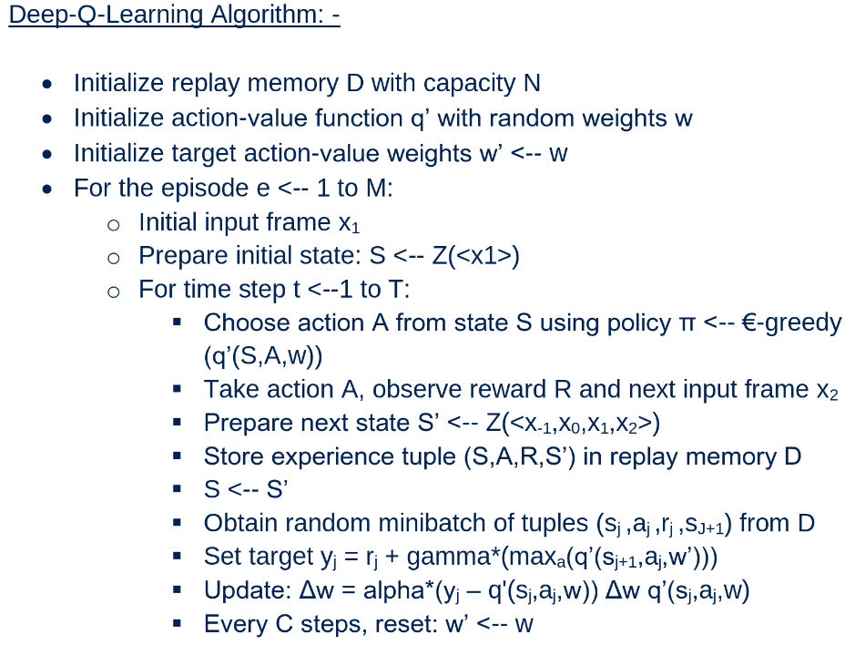

# Udacity--Deep-Reinforcement-Learning-Nano-Degree
This repository contains all the project codes related to Udacity Deep Reinforcement Learning Nano Degree

[//]: # (Image References)

[image1]: https://user-images.githubusercontent.com/10624937/42135602-b0335606-7d12-11e8-8689-dd1cf9fa11a9.gif "Trained Agents"
[image2]: https://user-images.githubusercontent.com/10624937/42386929-76f671f0-8106-11e8-9376-f17da2ae852e.png "Kernel"

![Trained Agents][image1]

## Project 1
The goal of the project is to demonstrate the abilities of a model-free reinforcement learning algorithm, particularly Deep Q-Learning. The project uses Unity environment, a game development framework and Pytorch, a deep learning framework, to train an agent to solve an environment consisting of 37 continuous states and 4 actions. The goal of the agent is to maximize expected cumulative reward by collecting only yellow banana's (+1 reward) and avoiding blue banana's (-1 reward).

